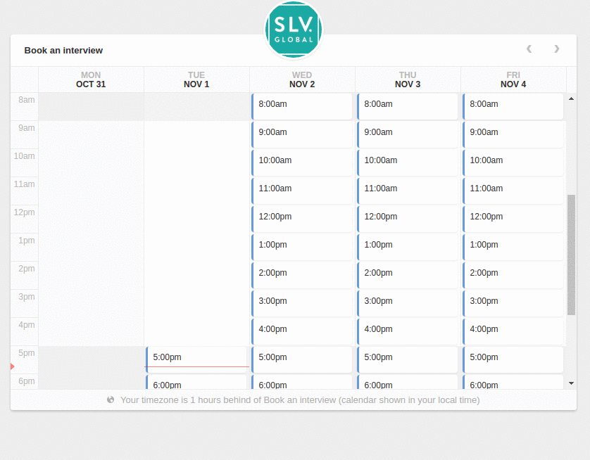

# fl-booking-js


A simple and beautiful appointment widget. An adaptation of [booking-js](https://github.com/timekit-io/booking-js).


Check the [demo](http://fourlabsldn.github.io/fl-booking-js/examples/bookings.html) out.



## How to use it

Just call it like this:

``` javascript
  flBooking({
    targetEl: document.querySelector('.booking-target'),
    autofillUser: 'James',
    autofillEmail: 'james@brown.com',
    timezone: {
      timezone: 'Europe/London',
      utc_offset: 0,
    },
    createBooking: data => { console.log(data); return Promise.resolve(data) }, // must return a promise
    getEvents: data => ({
        "data": [
          {
            "start": "2016-11-02T12:00:00.000Z",
            "end": "2016-11-02T13:00:00.000Z"
          }
        ]
      }),
  });
```

The events object must follow this type:

``` json
{
  "data" : [{
      "start": "2016-11-01T18:00:00.000Z",
      "end": "2016-11-01T19:00:00.000Z"
    }, {
      "start": "2016-11-01T19:00:00.000Z",
      "end": "2016-11-01T20:00:00.000Z"
    }, {
      "start": "2016-11-01T20:00:00.000Z",
      "end": "2016-11-01T21:00:00.000Z"
    }, {
      "start": "2016-11-01T21:00:00.000Z",
      "end": "2016-11-01T22:00:00.000Z"
    }]
}

```

The `createBooking` must return a `Promise` that should succeed if the booking is made and fail if it isnt.

`createBooking` receives one argument, which is an object looking like this:

``` json
{
  "event": {
    "start": "2016-11-02T14:00:00+00:00",
    "end": "2016-11-02T15:00:00+00:00",
    "what": "Interview",
    "where": "Online",
    "description": "Comment: \n",
    "calendar_id": "Interviews",
    "participants": [
      "james@brown.com"
    ],
    "invite": true,
    "my_rsvp": "accepted",
    "sync_provider": true
  },
  "customer": {
    "name": "James",
    "email": "james@brown.com",
    "timezone": "Europe/London",
    "id": "XXXXXXX user id XXXXXXXX"
  },
  "graph": "confirm_decline",
  "action": "create"
}
```

## Configuration

For more configuration options give a look at the [defaultConfig](./src/defaultConfig.js) file.


## Installation
**NPM**

```bash
npm install fl-booking-js --save
```
